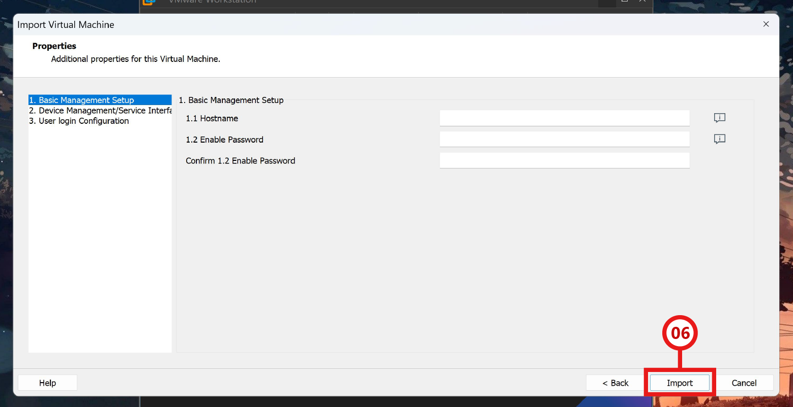
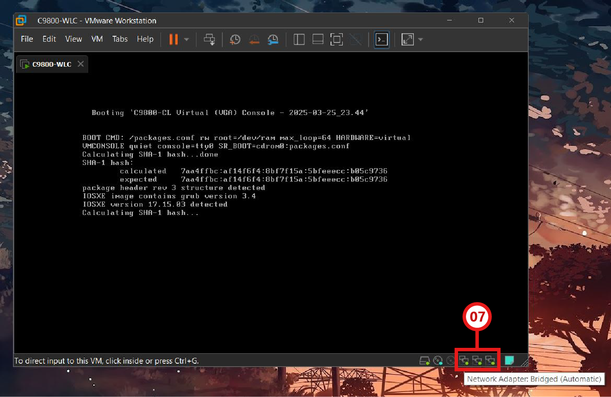
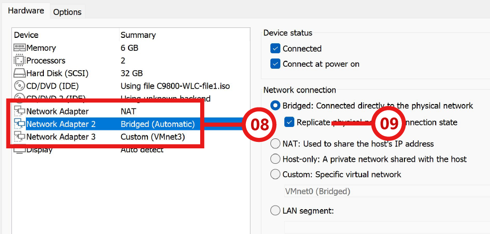

<!---   Your Monitor Number = #$34T#   --->  

> IP Addresses:  
> C9800-CL = 10.#$34T#.1.7
> WinServer = 10.#$34T#.1.8

 
 

| Device   | Port  |
| ---      | ---   |
| 1815w AP | fa0/2 |

 
 

## Setup L3 Switch (CoreBABA) with necessary cofnfigurations.
~~~
!@CSwitch
conf t
 hostname CoreBABA-#$34T#
 enable secret pass
 service password-encryption
 no logging console
 no ip domain lookup
 line cons 0
  password pass
  no login
  exec-timeout 0 0
  logging synchronous
 line vty 0 14
  password pass
  login
  exec-timeout 0 0
 !
 !
 vtp mode server
 vtp domain rivan
 vtp version 2
 vtp password C1sc0123
 !
 !
 vlan 10
  name WIFIVLAN
  exit
 vlan 50
  name CCTVVLAN
  exit
 vlan 100
  name VOIPVLAN
  exit
 int vlan 1
  ip add 10.#$34T#.1.4 255.255.255.0
  no shut
 int vlan 10
  ip add 10.#$34T#.10.4 255.255.255.0
  no shut
 !
 !
 int range fa0/1-2
  switchport trunk encaps dot1q
  switchport mode trunk
  switchport trunk native vlan 1
  switchport trunk allowed vlan all
  exit
 !
 !
 ip routing
 !
 !
 ip dhcp excluded-address 10.#$34T#.1.1 10.#$34T#.1.100
 ip dhcp excluded-address 10.#$34T#.10.1 10.#$34T#.10.100
 ip dhcp pool POOLDATA
  network 10.#$34T#.1.0 255.255.255.0
  default-router 10.#$34T#.1.4
  dns-server 10.#$34T#.1.10
  domain-name MGMTDATA.COM
 ip dhcp pool POOLWIFI
  network 10.#$34T#.10.0 255.255.255.0
  default-router 10.#$34T#.10.4
  dns-server 10.#$34T#.1.8
  domain-name WIFIDATA.COM 
  option 43 ip 10.#$34T#.1.7
  end
~~~

 
 

---
&nbsp;

## Deploy C9800-Cloud.

### 1. Deploy the Wireless Controller.
Open the VM `C9800-CL-universalk9_vga.17.15.03.ovf` __[01]__

&nbsp;
---
&nbsp;

### 2. Assign a name for the VM
In this guide, we use `C9800_WLC` __[02]__  
Then, click `Next` __[03]__

&nbsp;
---
&nbsp;

### 3. Deployment Options
Specify the deployment size to `100 APs, 1k Clients` __[04]__  
Then, click `Next` __[05]__

&nbsp;
---
&nbsp;

### 4. Properties
Leave everything as default and simply `Import` __[06]__

&nbsp;
---
&nbsp;

### 5. Network Adapters
While the VM is running, __double-click__ on either of the `three LANCards` __[07]__

&nbsp;
---
&nbsp;

### 6. Set the Network Adapters to the following:

__[08]__
| Network Adapter | Connection              | Network           |
| ---             | ---                     | ---               |
| Network Adapter | __NAT__                 | 208.8.8.0 /24     |
| NetAdapter 2    | __Bridged (Replicate)__ | 10.#$34T#.1.0 /24 |
| NetAdapter 3    | __VMNet3__              | 192.168.103.0 /24 |

 

> [!IMPORTANT]
> Make sure the Bridged Connection on Network Adapter 2 is also set to `Replicate physical network connection state` __[09]__

 

 
 

Confirm the changes by selecting __Ok__, then __Power On__ the Virtual Machine.

&nbsp;
---
&nbsp;

### 6. Configure the C9800
~~~
conf t
 hostname C9800-WLC
 enable secret pass
 service password-encryption
 no logging cons
 no ip domain lookup
 line vty 0 48
  login local
  transport input all
  exec-timeout 0 0
  exit
 username admin privilege 15 secret C1sc0123
 !
 !
 vtp mode server
 vtp version 2
 vtp domain rivan
 vtp password C1sc0123
 !
 !
 vlan 10
  name WIFIVLAN
  exit
 int vlan 1
  ip add 10.#$34T#.1.7 255.255.255.0
  no shut
 int g1
  no switchport
  ip add 208.8.8.7 255.255.255.0
  no shut
 int g2
  switchport
  switchport trunk allowed vlan all
  switchport trunk native vlan 1
  switchport mode trunk
 !
 !
 ip route 0.0.0.0 0.0.0.0 208.8.8.2
 ip route 10.0.0.0 255.0.0.0 10.#$34T#.1.4
 ip route 200.0.0.0 255.255.255.0 10.#$34T#.1.4
 !
 !
 ntp server 216.239.35.12
 ntp master 4
 ntp source vlan1
 end
~~~

 
 

&nbsp;
---
&nbsp;

### 7. Access the GUI of C9800 by using the IP on its GigabitEthernet 1 interface https://208.8.8.7/ 

&nbsp;
---
&nbsp;

### 8. Login to the GUI

> Username: admin  
> Password: pass  

 

&nbsp;
---
&nbsp;

### 9. Configure the General Settings
Make sure the Country is __US__, and the NTP server is the IP of __time.google.com__

 

 

For __Wireless Management Settings__, set the management Port Number to __GigabitEthernet2__, which is where we Bridged the connection to the real switch.

 

Set the __Wireless Management VLAN__ to __1__

 

The __Wireless Management IP__ is __10.#$34T#.1.7__
and the Subnet Mask as __255.255.255.0__

Then __Next__

&nbsp;
---
&nbsp;

### 10. Setup a WLAN (Optional)

 

&nbsp;
---
&nbsp;

### 10. Modify Self-Signed Certificates and AP-Group configs

&nbsp;
---
&nbsp;

### 11. Verify configuration summary

 

Then Apply

&nbsp;
---
&nbsp;

### 13. Redefine C9800 ports to access on G2
~~~
conf t
 int g2
  switchport trunk native vlan 1
  switchport trunk allowed vlan all
  switchport mode trunk
  end
~~~

&nbsp;
---
&nbsp;

### 12. Associate self-signed certificate for vwlc-ssc

~~~
conf t
 wireless management interface vlan 1       
 end
wireless config vwlc-ssc key-size 2048 signature-algo sha256 password 0 C1sc0123
~~~

 
 
 
 

### Once the AP has been connected, it will automatically join the WLC.  

 

 
 

---
&nbsp;

## Exercise 01: Troubleshoot `Wireless-#$34T#` wifi so that it becomes operable in the network.

### 1. Go to `Configuration` > Under Wireless Setup, select `Advanced`

&nbsp;
---
&nbsp;

### 2. View the Wireless Setup Flow Overview then, when ready, select `Start Now`

&nbsp;
---
&nbsp;

### 3. Under the pipeline, Tags & Profiles, select the List View of `WLAN Profile`

&nbsp;
---
&nbsp;

### 4. Select the existing WLAN, `Wireless-91`

&nbsp;
---
&nbsp;

### 5. Make sure `6GHz is disabled` then select `Security`

&nbsp;
---
&nbsp;

### 6. Set the Auth Key Mgmt (AKM) to `PSK` and `PSK-SHA256` with a Pre-Shared Key `C1sc0123`. Then `Update & Apply to Device`

&nbsp;
---
&nbsp;

### 7. Now select the List View for Policy Profile. Then `Add` a policy.

&nbsp;
---
&nbsp;

### 8. `Enable` the status of the policy, then add the following Name & Description `Wireless-POL`. Then select `Access Policies`.

&nbsp;
---
&nbsp;

### 9. Under `Access Policies`, set the VLAN for the clients joining the WLAN to VLAN 10, `WIFIVLAN`. Then select `Advanced`.

&nbsp;
---
&nbsp;

### 10. Assign the DHCP server for the WLAN, `10.#$34T#.10.4`, finally `Apply to Device`.

&nbsp;
---
&nbsp;

### 11. Confirm the changes and make sure Wireless-POL is now listed. Next, select the List View for `Policy Tag`

&nbsp;
---
&nbsp;

### 12. `Add` a policy tag.

&nbsp;
---
&nbsp;

### 13. Set the Name and Description to `AP-WLANs`. Then, under WLAN-POLICY Maps, `Add` a mapping and set the WLAN Profile to `Wireless-#$34T#` with a Policy Profile `Wireless-POL`. Then, `Apply to Device`.

&nbsp;
---
&nbsp;

### 14. Confirm the changes and make sure AP-WLANs is now listed. Next, select the List View for `Flex Profile`

&nbsp;
---
&nbsp;

### 15. `Add` a flex profile.

&nbsp;
---
&nbsp;

### 16. Set the Name and Description to `AP-Configs`. Then, select the VLAN tab.

&nbsp;
---
&nbsp;

### 17. `Add` a VLAN, specifically `WIFIVLAN` with the same VLAN ID `10`. Then, `Save`.

&nbsp;
---
&nbsp;

### 18. Then, `Apply to Device`.

&nbsp;
---
&nbsp;

### 19. Confirm the changes and make sure AP-Configs is now listed. Next, select the List View for `Site Tag`

&nbsp;
---
&nbsp;

### 20. `Add` a site tag

&nbsp;
---
&nbsp;

### 21. Set the Name and Description to `AP-Profiles`. Then, set the Flex Profile to `AP-Configs`. Finally, `Apply to Device`.

&nbsp;
---
&nbsp;

### 22. Confirm the changes and make sure AP-Profiles is now listed. Next, select the List View for `Tag APs`

&nbsp;
---
&nbsp;

### 23. Select the desired AP to be configured, then select `+Tag APs`

&nbsp;
---
&nbsp;

### 24. Assign the Policy with `AP-WLANs`, Site to `AP-Profiles`, RF to `default-rf-tag`

&nbsp;
---
&nbsp;

### 25. Confirm the setup by making sure that Results is a `Success`

### Exercise 02: Create WLANs for `SOC-TEAM` on VLAN 11. Verify by connecting on mobile and checking if you got the correct IP from the DHCP Server.
NETWORK ADDRESS: 10.#$34T#.11.0/24

~~~
!@CoreBABA
conf t
 vlan 11
  name SOC-TEAM
  exit
 int vlan 11
  description SOC-TEAM-GW
  ip add 10.#$34T#.11.4 255.255.255.0
  ip ospf 1 area 0
  no shut
 !
 ip dhcp excluded-address 10.#$34T#.11.1 10.#$34T#.11.100
 ip dhcp pool SOCPOOL
  network 10.#$34T#.11.0 255.255.255.0
  default-router 10.#$34T#.11.4 255.255.255.0
  domain-name SOC-TEAM.COM
  dns-server 10.#$34T#.1.10
  end
~~~

 
 

---
&nbsp;

### Exercise 03: Create WLANs for `THREAT-HUNTERS` on VLAN 12. Using the network address 10.#$34T#.12.0/24

~~~
!@CoreBABA
conf t
 vlan 12
  name THREAT-HUNTERS
  exit
 int vlan 12
  description THREAT-HUNTERS-GW
  ip add 10.#$34T#.12.4 255.255.255.0
  ip ospf 1 area 0
  no shut
 !
 ip dhcp excluded-address 10.#$34T#.12.1 10.#$34T#.12.100
 ip dhcp pool THUNTPOOL
  network 10.#$34T#.12.0 255.255.255.0
  default-router 10.#$34T#.12.4 255.255.255.0
  domain-name THUNT.COM
  dns-server 10.#$34T#.1.10
  end
~~~

 
 

---
&nbsp;

### Exercise 04: Modify `SOC-TEAM` Wifi for `Port-Based Authentication (802.1x)`
Prerequisites  
- Windows Server 2022 VM  
  - Static IP addressing  
    - IP: 10.#$34T#.1.8  
	- Mask: 255.255.255.0  
	- Gateway: None  
	- DNS: 127.0.0.1  
  - DNS Suffix  
    - Suffix: rivanm.com  

- Disabled Firewall  
- Rename Computer  

Restart the Computer to Apply changes  

&nbsp;
---
&nbsp;

### Install the necessary roles and features
1. Active Directory Domains and Services 
  - Promote this server to a domain controller. 
    - Add a new forest: This MUST be your DNS suffix: rivanm.com 
	  - Add a DSRM password: C1sc0123 
	  - Do NOT create DNS delegation 
	  - Allow NetBIOs to resolve the name 
	  - Leave Paths as default 
	
	  - Install

 

2. Network Policy Server

 

3. Active Directory Certificate Authority
