<!---   Your Monitor Number = #$34T#   --->  

> IP Addresses:    
> C9800-CL = 10.#$34T#.1.7  
> WinServer = 10.#$34T#.1.8  

 
 

| Device   | Port  |
| ---      | ---   |
| 1815w AP | fa0/2 |

 
 

## Setup L3 Switch (CoreBABA) with necessary cofnfigurations.
~~~
!@CSwitch
conf t
 hostname CoreBABA-#$34T#
 enable secret pass
 service password-encryption
 no logging console
 no ip domain lookup
 line cons 0
  password pass
  no login
  exec-timeout 0 0
  logging synchronous
 line vty 0 14
  password pass
  login
  exec-timeout 0 0
 !
 !
 vtp mode server
 vtp domain rivan
 vtp version 2
 vtp password C1sc0123
 !
 !
 vlan 10
  name WIFIVLAN
  exit
 vlan 50
  name CCTVVLAN
  exit
 vlan 100
  name VOIPVLAN
  exit
 int vlan 1
  ip add 10.#$34T#.1.4 255.255.255.0
  no shut
 int vlan 10
  ip add 10.#$34T#.10.4 255.255.255.0
  no shut
 !
 !
 int range fa0/1-2
  switchport trunk encaps dot1q
  switchport mode trunk
  switchport trunk native vlan 1
  switchport trunk allowed vlan all
  exit
 !
 !
 ip routing
 !
 !
 ip dhcp excluded-address 10.#$34T#.1.1 10.#$34T#.1.100
 ip dhcp excluded-address 10.#$34T#.10.1 10.#$34T#.10.100
 ip dhcp pool POOLDATA
  network 10.#$34T#.1.0 255.255.255.0
  default-router 10.#$34T#.1.4
  dns-server 10.#$34T#.1.10
  domain-name MGMTDATA.COM
 ip dhcp pool POOLWIFI
  network 10.#$34T#.10.0 255.255.255.0
  default-router 10.#$34T#.10.4
  dns-server 10.#$34T#.1.8
  domain-name WIFIDATA.COM 
  option 43 ip 10.#$34T#.1.7
  end
~~~

 
 

---
&nbsp;

## Deploy C9800-Cloud.

### 1. Deploy the Wireless Controller.
Open the VM `C9800-CL-universalk9_vga.17.15.03.ovf` __[01]__

 

&nbsp;
---
&nbsp;

### 2. Assign a name for the VM
In this guide, we use `C9800_WLC` __[02]__  
Then, click `Next` __[03]__

 

&nbsp;
---
&nbsp;

### 3. Deployment Options
Specify the deployment size to `100 APs, 1k Clients` __[04]__  
Then, click `Next` __[05]__

 

&nbsp;
---
&nbsp;

### 4. Properties
Leave everything as default and simply `Import` __[06]__

 

&nbsp;
---
&nbsp;

### 5. Network Adapters
While the VM is running, __double-click__ on either of the `three LANCards` __[07]__

 

&nbsp;
---
&nbsp;

### 6. Set the Network Adapters to the following:

| [08] Network Adapter | Connection              | Network           |
| ---                  | ---                     | ---               |
| Network Adapter      | __NAT__                 | 208.8.8.0 /24     |
| NetAdapter 2         | __Bridged (Replicate)__ | 10.#$34T#.1.0 /24 |
| NetAdapter 3         | __VMNet3__              | 192.168.103.0 /24 |

 

> [!IMPORTANT]
> Make sure the Bridged Connection on Network Adapter 2 is also set to `Replicate physical network connection state` __[09]__

 

 
 

Confirm the changes by selecting __Ok__, then __Power On__ the Virtual Machine.

&nbsp;
---
&nbsp;

### 7. Configure the C9800
~~~
conf t
 hostname C9800-WLC
 enable secret pass
 service password-encryption
 no logging cons
 no ip domain lookup
 line vty 0 48
  login local
  transport input all
  exec-timeout 0 0
  exit
 username admin privilege 15 secret C1sc0123
 !
 !
 vtp mode server
 vtp version 2
 vtp domain rivan
 vtp password C1sc0123
 !
 !
 vlan 10
  name WIFIVLAN
  exit
 int vlan 1
  ip add 10.#$34T#.1.7 255.255.255.0
  no shut
 int g1
  no switchport
  ip add 208.8.8.7 255.255.255.0
  no shut
 int g2
  switchport
  switchport mode trunk
  switchport trunk allowed vlan all
  switchport trunk native vlan 1
 !
 !
 ip route 0.0.0.0 0.0.0.0 208.8.8.2
 ip route 10.0.0.0 255.0.0.0 10.#$34T#.1.4
 ip route 200.0.0.0 255.255.255.0 10.#$34T#.1.4
 !
 !
 ntp server 216.239.35.12
 ntp master 4
 ntp source vlan1
 end
show ip int br
!
~~~

 
 

&nbsp;
---
&nbsp;

### 8. Access the GUI
Open the management interface IP `https://208.8.8.7/` on a browser __[10]__.  
Ignore the the *Warning* and select `Advanced...` __[11]__, then `Accept the Risk and Continue` __[12]__  

 

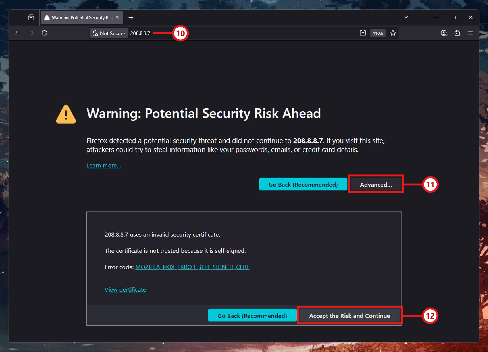

&nbsp;
---
&nbsp;

### 9. Login using the admin account
> Username __[13]__ : admin  
> Password __[14]__ : C1sc0123  

 

Then, `Log In` __[15]__  

 

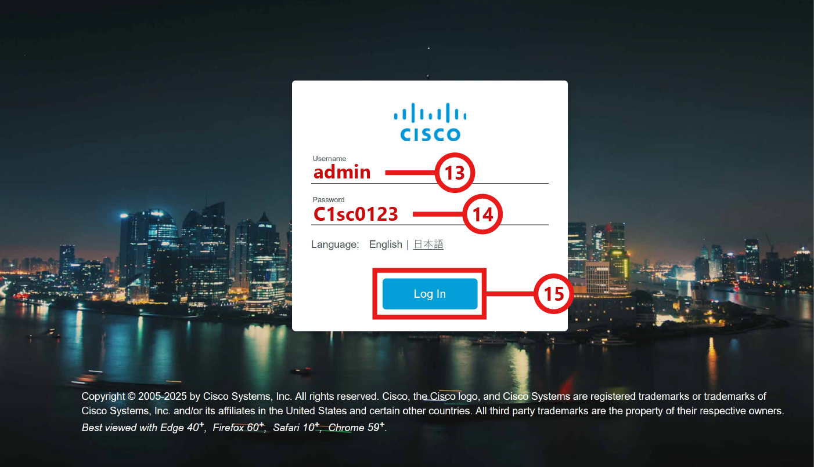

&nbsp;
---
&nbsp;

### 10. Configure the General Settings
- Set the hostname __[16]__ : `C9800-WLC`  
- Time/Timezone __[17]__ : `UTC`  
- NTP Servers __[18]__ : `216.239.35.0`  

 

> [!NOTE]
> The NTP Server is the IP address of `time.google.com`  
> Make sure to add it into the list.  

 

Then, Scroll Down to Wireless Management Settings __[19]__  

 

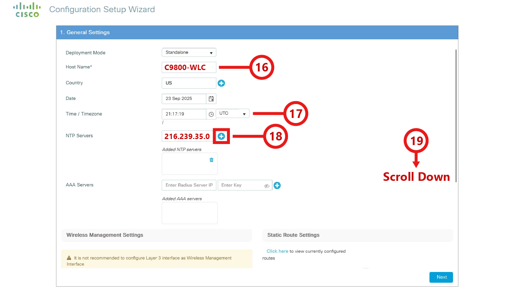

 

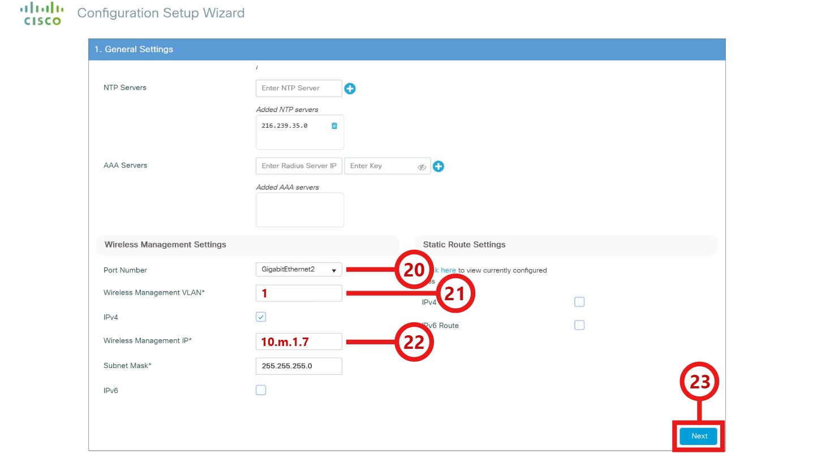

 

For __Wireless Management Settings__,  
- Set the management Port Number to __[20]__ : `GigabitEthernet2`  
- Wireless Management VLAN __[21]__ : `VLAN 1`  
- Wireless Management IP __[22]__ : `10.#$34T#.1.7`  

 

Then, click `Next` __[23]__  

&nbsp;
---
&nbsp;

### 11. Wireless Network Settings
`+ Add` __[24]__ a WLAN  

 

 

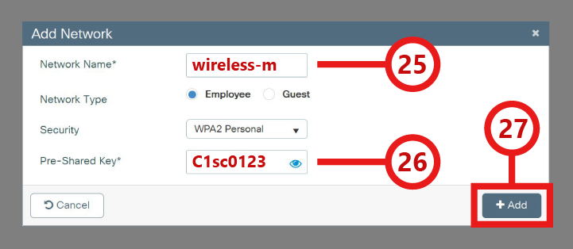

 

Set the following settings:  
- Network Name* __[25]__ : `wireless-#$34T#`  
- Pre-Shared Key __[26]__ : `C1sc0123`  

 

Then, `+Add` __[27]__

&nbsp;
---
&nbsp;

### 12. Advanced Settings
Modify Self-Signed Certificates and AP-Group configs:  
- RSA Key-Size __[28]__ : `2048`  
- Signature Algorithm : `sha256`  
- Password __[29]__ : `C1sc0123`  

 

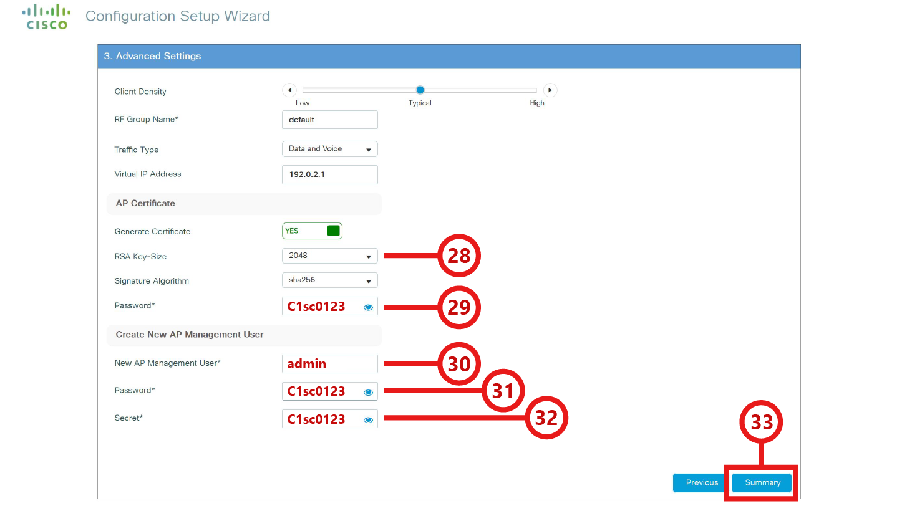

 

__Create New AP Management User__  
- New AP Management User* __[30]__ : `admin`  
- Password* __[31]__ : `C1sc0123`  
- Secret* __[32]__ : `C1sc0123`  

 

Finally, select `Summary` __[33]__

&nbsp;
---
&nbsp;

### 13. Verify configuration summary

 

Select `Finish` __[34]__  

 

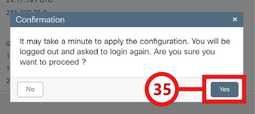

 

Confirm the setup by selecting `Yes` __[35]__

&nbsp;
---
&nbsp;

### 14. Set C9800 ports to access on G2
~~~
conf t
 int g2
  switchport mode trunk
  switchport trunk allowed vlan all
  switchport trunk native vlan 1
  end
~~~

&nbsp;
---
&nbsp;

### 15. Set a self-signed certificate for the WLC
~~~
conf t
 wireless management interface vlan 1       
 end
wireless config vwlc-ssc key-size 2048 signature-algo sha256 password 0 C1sc0123
~~~

 
 

### Once the AP has been connected, it will automatically join the WLC.  

 

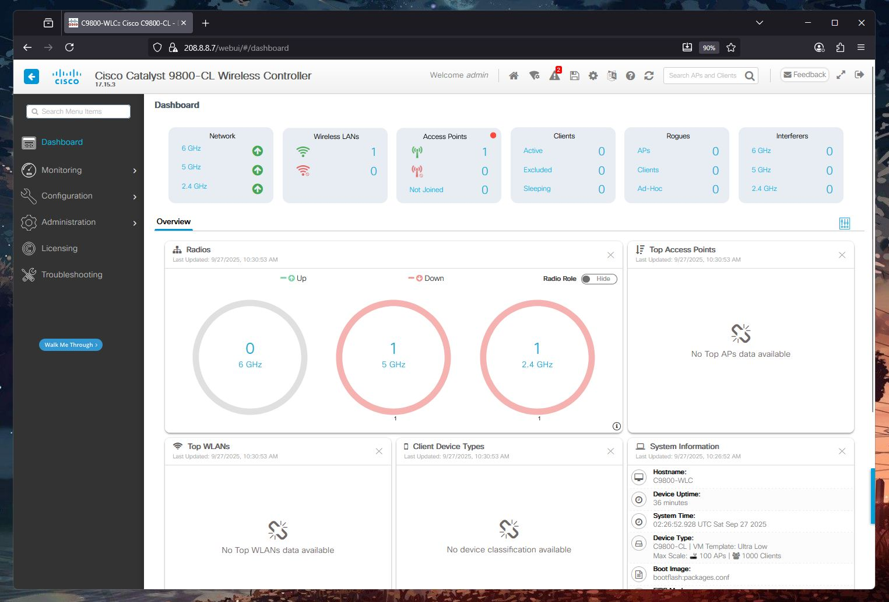

 
 

---
&nbsp;

## Exercise 01: Configure `Wireless-#$34T#` so that client traffic belongs to VLAN 10.
### 1. Access the Wireless Advanced Setup Page.
Go to `Configuration` __[01]__ > Under Wireless Setup, select `Advanced` __[02]__  

 

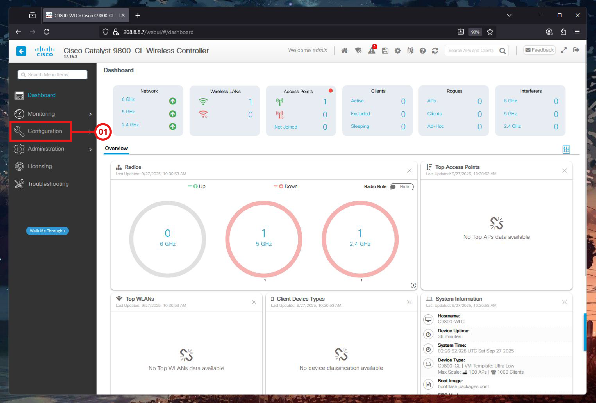

 

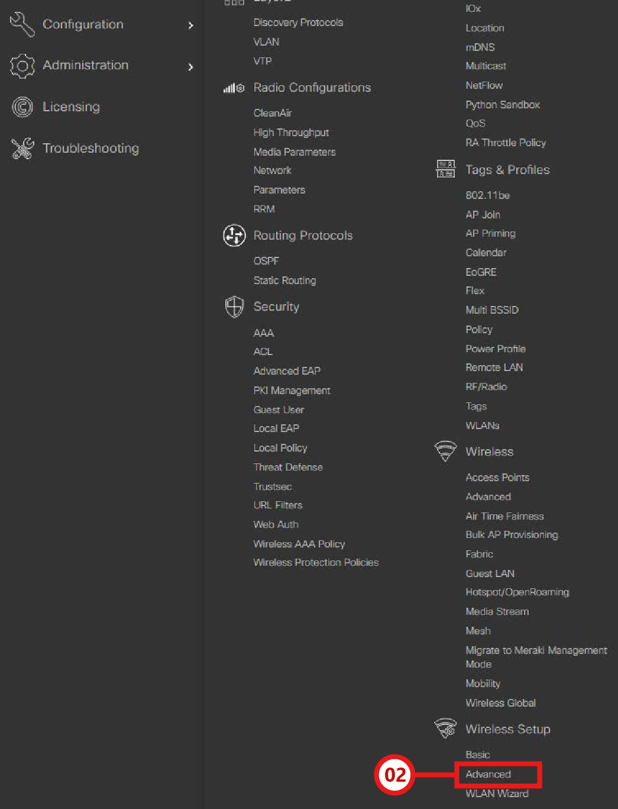

&nbsp;
---
&nbsp;

### 2. Wireless Setup Flow Overview
When ready, select, `Start Now` __[03]__

 

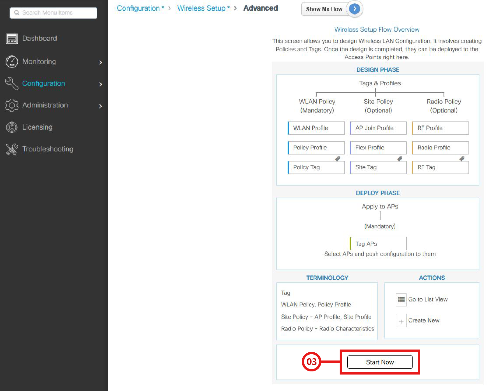

&nbsp;
---
&nbsp;

### 3. Setup WLAN Profile
Select the List View icon of `WLAN Profile` __[04]__

 

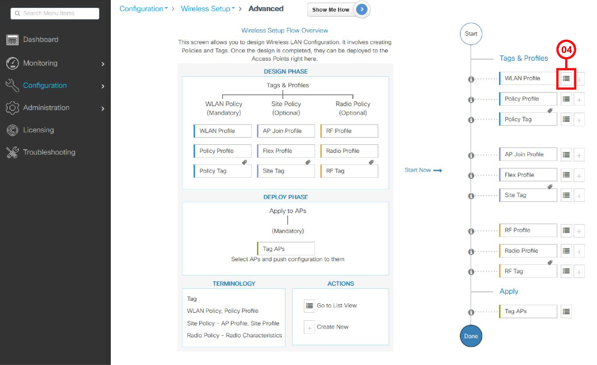

&nbsp;
---
&nbsp;

Click on the existing WLAN, `wireless-#$34T#` __[05]__

 

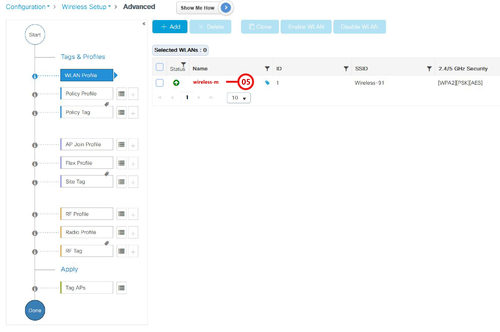

&nbsp;
---
&nbsp;

Make sure `6GHz is disabled` __[06]__ then select `Security` __[07]__  

 

&nbsp;
---
&nbsp;

Set the Auth Key Mgmt (AKM) to `PSK` and `PSK-SHA256` __[08]__  
with a Pre-Shared Key `C1sc0123`

 

Then `Update & Apply to Device` __[09]__

 

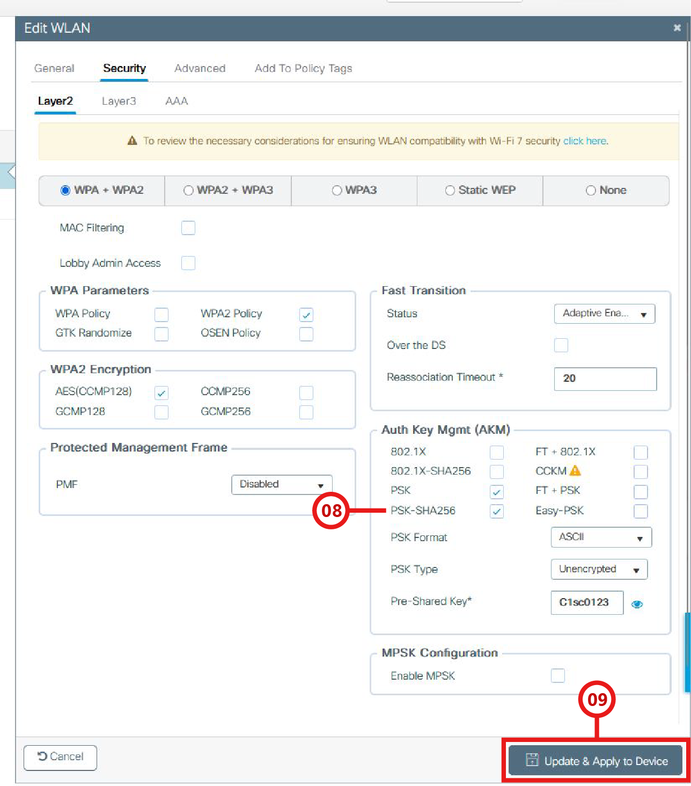

&nbsp;
---
&nbsp;

### 4. Setup Policy Profile
Now select the List View for `Policy Profile` __[10]__

 

Then `+ Add` a policy __[11]__

 

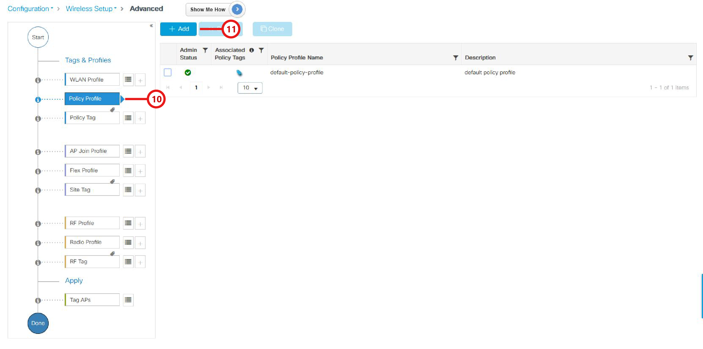

&nbsp;
---
&nbsp;

Set the Name* __[12]__ and Description __[13]__ to `wireless-pol`  
then, `Enable` the status of the policy __[14]__  

 

Then, select `Access Policies` __[15]__

 

&nbsp;
---
&nbsp;

Under Access Policies, set the VLAN/VLAN Group __[16]__ for the clients to VLAN 10, `WIFIVLAN` __[17]__  

 

Then select `Advanced` __[18]__

 

&nbsp;
---
&nbsp;

Assign the DHCP server for the WLAN, `10.#$34T#.10.4` __[19]__
finally `Apply to Device` __[20]__

 

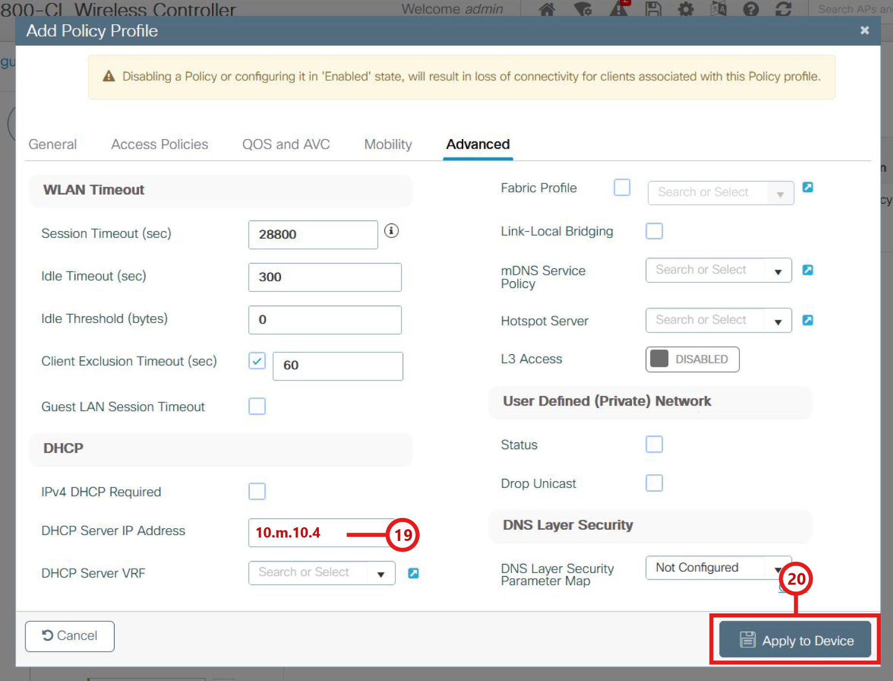

&nbsp;
---
&nbsp;

Confirm the changes and make sure wireless-pol is now listed. 
Next, select the List View icon for `Policy Tag` __[21]__

 

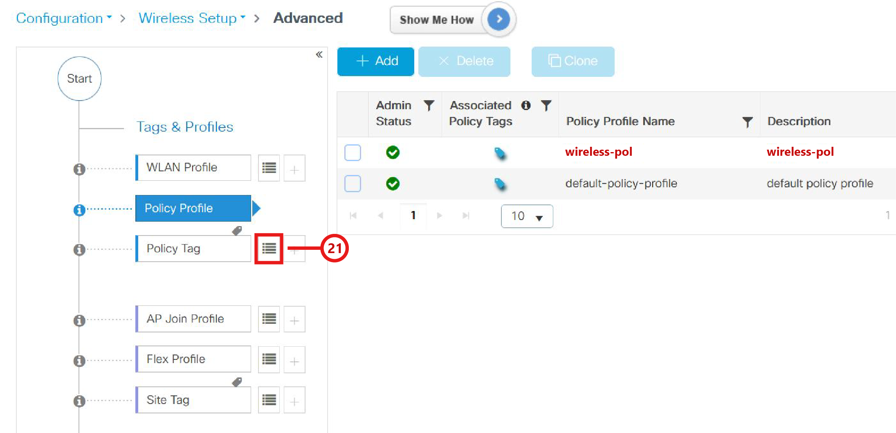

&nbsp;
---
&nbsp;

### 5. Tag the WLAN profile with its corresponding policy profile
`+ Add` a policy tag __[22]__

 

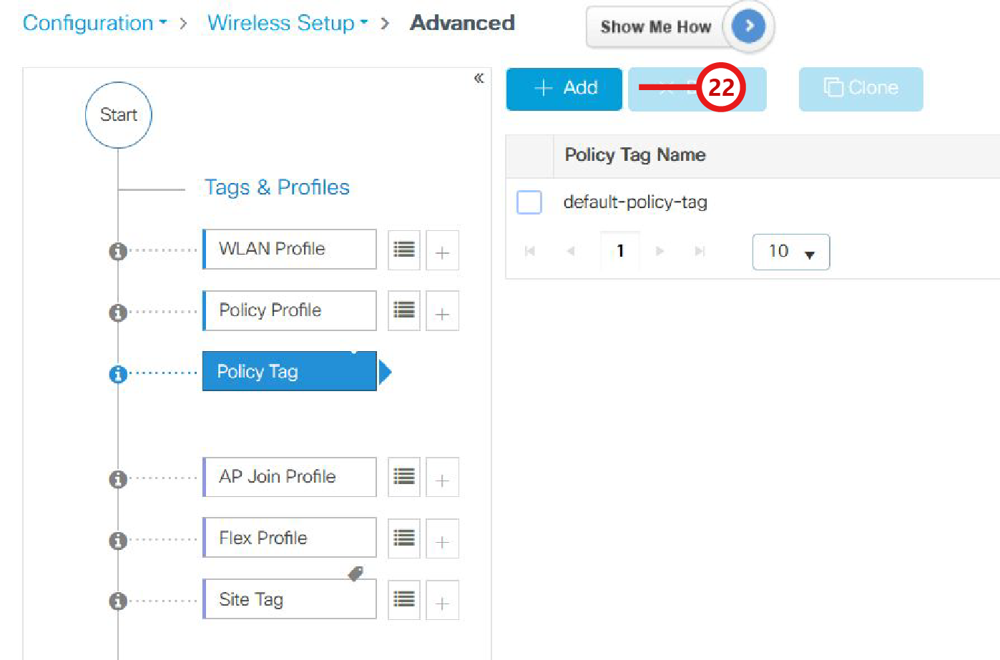

&nbsp;
---
&nbsp;

Set the Name __[23]__ and Description __[24]__ to `ap-wlans`  
Then, under WLAN-POLICY Maps, 
- `+ Add` a mapping __[25]__
- Set the WLAN Profile to `wireless-#$34T#` __[26]__
- With a Policy Profile `wireless-pol` __[27]__

 

Then, confirm the changes by selecting the `check` icon __[28]__   
Finally, `Apply to Device` __[29]__  

 

&nbsp;
---
&nbsp;

Confirm the changes and make sure ap-wlans is now listed.  
Next, select the List View for `Flex Profile` __[30]__

 

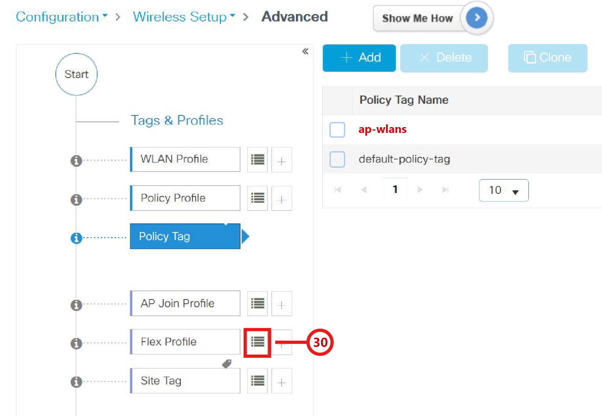

&nbsp;
---
&nbsp;

### 6. Setup Flex Profile
The 1815w Access point is configured for Flexconnect mode, which means we only need to configure the Flex Profile.

 

`+ Add` a flex profile __[31]__

 

&nbsp;
---
&nbsp;

Set the Name and Description to `ap-configs` __[32 & 33]__  
Then, select the VLAN tab. __[34]__

 

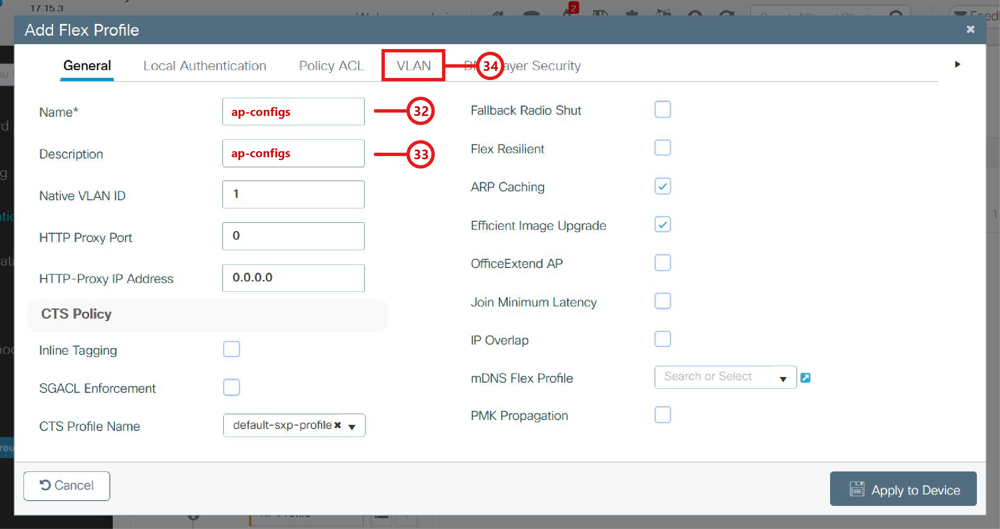

&nbsp;
---
&nbsp;

`+ Add` a VLAN to the list __[35]__,  
specifically `WIFIVLAN` __[36]__  
with the same VLAN ID `10` __[37]__  

 

Then, `Save` __[38]__

 

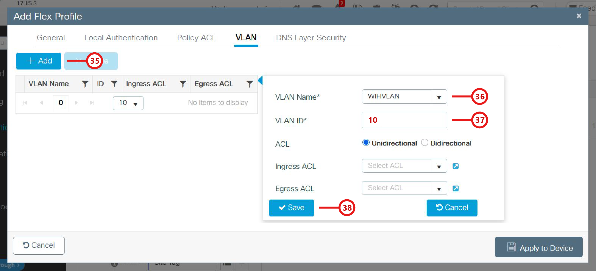

&nbsp;
---
&nbsp;

Then, `Apply to Device` __[39]__

 

&nbsp;
---
&nbsp;

Confirm the changes and make sure ap-configs is now listed.  
Next, select the List View icon for `Site Tag` __[40]__  

 

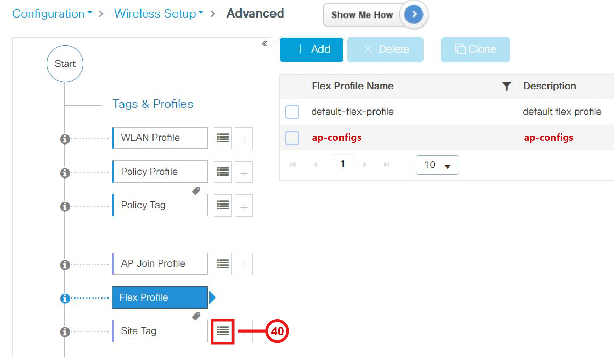

&nbsp;
---
&nbsp;

### 7. Assign a configuration profile for any AP, either on local mode or flexconnect mode, that joins the WLC.
`Add` a Site Tag __[40]__

 

&nbsp;
---
&nbsp;

Set the Name and Description to `ap-profiles` __[42 & 43]__  
Then, set the Flex Profile to `ap-configs` __[44]__  

 

Finally, `Apply to Device` __[45]__  

 

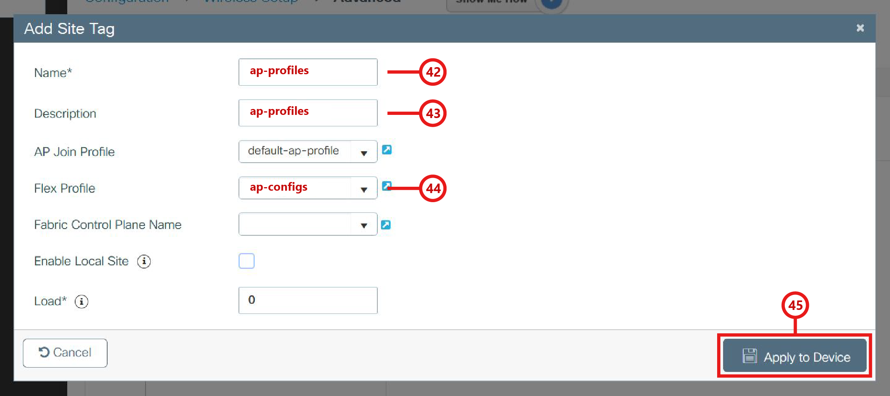

&nbsp;
---
&nbsp;

Confirm the changes and make sure ap-profiles is now listed. 
Next, select the List View icon for `Tag APs` __[46]__

 

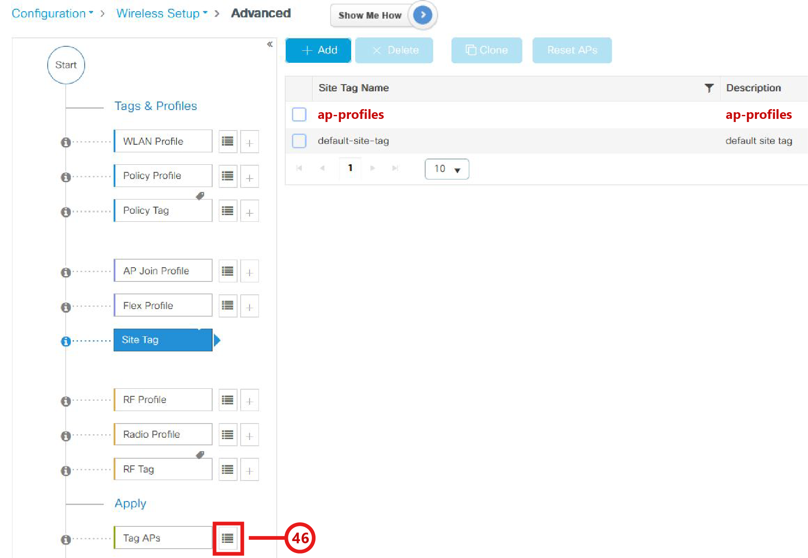

&nbsp;
---
&nbsp;

### 8. Assign the profiles to joined APs
Check the desired AP to be configured with the WLANs __[47]__  
Then, select `+ Tag APs` __[48]__  

 

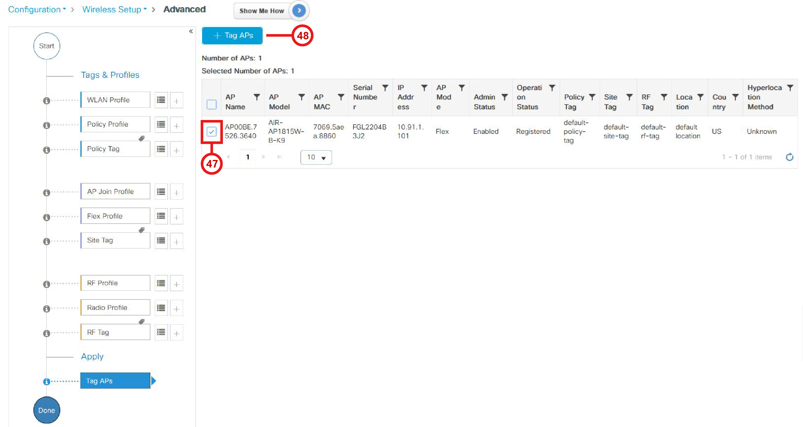

&nbsp;
---
&nbsp;

Assign the following:
- Policy: `wireless-pol` __[49]__
- Site: `ap-profiles` __[50]__
- RF: `default-rf-tag`

 

Finally, `Apply to Device` __[51]__

 

&nbsp;
---
&nbsp;

### 25. Confirm the setup by making sure that Results is a `Success`
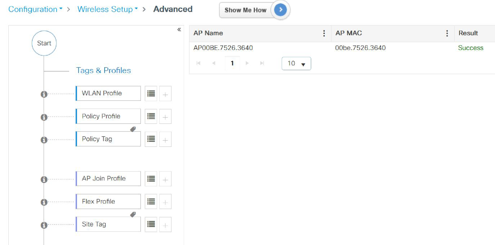

 
 

---
&nbsp;

### Exercise 01: Design and implement a network for SOC-GROUP with a maximum of 45 users.
- Use the available network address 10.#$34T#.11.0/24  
- Reserve the first 10 IPs  
- Use VLAN 11 for the network.  
- Make sure clients can connect from both wired, and wireless devices.  
- Verify by connecting on mobile and checking if you got the correct IP from the DHCP Server.  

 

Show Answer

C: 45 users = 6 bits  
S: 32 - 6 = /26 (4th, 64i)  
I:  
  - 10.#$34T#.11.0 255.255.255.192  
  - 10.#$34T#.11.64 255.255.255.192   

 

__NETWORK ADDRESS: `10.#$34T#.11.0 255.255.255.192`__  

 

~~~
!@CoreBABA
conf t
 vlan 11
  name SOC-GROUP
  exit
 int vlan 11
  description SOC-GROUP
  ip add 10.#$34T#.11.4 255.255.255.192
  ip ospf 1 area 0
  no shut
 !
 ip dhcp excluded-address 10.#$34T#.11.1 10.#$34T#.11.10
 ip dhcp pool SOC-GROUP
  network 10.#$34T#.11.0 255.255.255.192
  default-router 10.#$34T#.11.4
  domain-name SOC-GROUP.COM
  dns-server 10.#$34T#.1.8
  end
~~~
	

 
 

---
&nbsp;

### Exercise 02: Design and implement a network for NOC-GROUP with a maximum of 27 users.
- Use the available network address 10.#$34T#.12.0/24  
- Reserve the first 10 IPs  
- Use VLAN 12 for the network.  
- Make sure clients can connect from both wired, and wireless devices.  
- Verify by connecting on mobile and checking if you got the correct IP from the DHCP Server.  

 

Show Answer

C: 27 users = 5 bits  
S: 32 - 5 = /27 (4th, 32i)  
I:  
  - 10.#$34T#.12.0 255.255.255.224  
  - 10.#$34T#.12.32 255.255.255.224  

 

__NETWORK ADDRESS: `10.#$34T#.12.0 255.255.255.224`__  

 

~~~
!@CoreBABA
conf t
 vlan 11
  name NOC-GROUP
  exit
 int vlan 11
  description NOC-GROUP
  ip add 10.#$34T#.12.4 255.255.255.224
  ip ospf 1 area 0
  no shut
 !
 ip dhcp excluded-address 10.#$34T#.12.1 10.#$34T#.12.10
 ip dhcp pool NOC-GROUP
  network 10.#$34T#.12.0 255.255.255.224
  default-router 10.#$34T#.12.4
  domain-name NOC-GROUP.COM
  dns-server 10.#$34T#.1.8
  end
~~~
	

 
 

---
&nbsp;

### Exercise 03: Modify `SOC-GROUP` & `NOC-GROUP` Wifi for `Wireless Enterprise Authentication (802.1x)`

